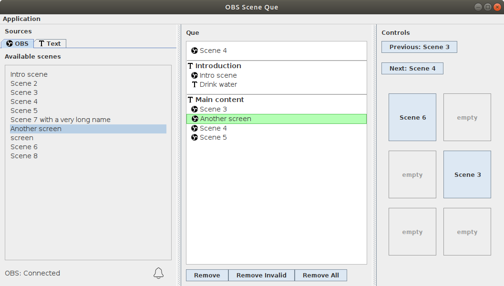

OBS Scene Queue

_Basic application to easily control a scene sequence for OBS_

_By Samuel-Anton Jansen_

_Screenshot which shows scene "Another screen" as the current active queue item. On the right, six Quick Access Buttons are shown._

**Note:** _Que_ has been renamed to _Queue_. This might not be always the case, as for file names.

#### Requirements

- Installation of OBS
- Installation of OBS Websocket (at least v4.1.0)
- Installation of Java (at least Java 1.8 / Java 8) on the computer where OBS Scene Queue will be running

If OBS is running on another computer, make sure the computer where OBS Scene Queue is running on can reach the other computer. Use the Websocket Scanner built in OBS Scene Queue to quickly identify the other computer where OBS is running.

## Build

You can download all versions from [GitHub](https://github.com/sampie777/obs-scene-que/), or build this application yourself using Maven. [Launch4j](http://launch4j.sourceforge.net/) is used to generate .exe files from the compiled JARs (this is also integrated in the Maven package step).

## OBS Scene Queue application setup

1. Download and **install [obs-websocket](https://github.com/Palakis/obs-websocket)** (>= v4.0.0) for your OBS application.
1. Make sure you have at least Java 8 installed.
1. Make sure your OBS websocket is discoverable by the computer you will run this application on. If it's the same computer, no worries. 
1. **Launch this application** (by running the executable JAR file with Java or running the EXE file) and enjoy.
1. **Edit the settings** if needed. This can be done using the menu Application menu -> Settings or editing the _obs-scene-que.properties_ file. This file will be created after first launch of the application. Don't run the application when editing this file. Application restart will be needed after changing the application settings.

### Features

### Queue List

#### Creation

Create a queue by drag-and-dropping scenes or other queue items from the Sources panel (left panel) to the queue list (middle panel).

#### Control

Control the queue by using the control buttons "Previous" and "Next". These buttons will show which queue item will be previous or next. Using the separate control window, the current queue item will also be displayed for clarity. 

When a queue item becomes active (thus the new current queue index), it will be executed. This execution is different for each queue item type. 

To set the current queue index to a specific queue item, use `MOUSE DOUBLE CLICK` to activate that item and set is as the new current queue index. You can also use `ENTER` key on a selected queue item. To set this item as the new queue index, but without activating that item, use `CTRL + MOUSE CLICK` on that item. 

Note that settings can be changed in order to adjust the behaviour of activating 'Execute After Previous' queue items after activating a queue item using `MOUSE DOUBLE CLICK` or `ENTER`. 

#### Execute After Previous
Mark a queue item to be executed after the previous queue item is executed. In this way, when a queue item becomes active, all the directly following queue items which are marked as Execute After Previous, will also be activated and executed in order. 

When using the `ENTER` key on a selected queue item, the Execute After Previous items will be activated in order, as normal behaviour. When activating an queue item by `DOUBLE CLICK`, it will only activate that item and NOT it's Execute After Previous items. 
 
Marking a queue item as Execute After Previous: 
- `SHIFT + RIGHT ARROW` will mark a queue item to be executed after the execution of the previous queue item.
- `SHIFT + LEFT ARROW` will unmark a queue item to be executed after the execution of the previous queue item.

#### Quick Access Buttons

Drag and drop any queue item from the Source or Queue list onto a Quick Access Button to assign this item to this button. Clicking the Quick Access Button will execute the queue item. Note that this will not interfere with the queue at all.
Use `CTRL + MOUSE CLICK` on a Quick Access Button to clear this button's state. 

Display of the plugin icon in the button can be turned on/off in the settings. 

#### Network Scanner

When using OBS Scene Queue on another computer as OBS projector itself, it can be quite a struggle to figure out the correct IP address of the OBS projector computer. Head to Application menu -> Network Scanner to let OBS Scene Queue scan for any possible OBS projector hosts on your local network. This scanning is done by querying the default OBS websocket port 4444 on all possible IP address available on your local network(s). 

The default timeout used for the scanning progress is 200 ms. This value can be increased in the Network Scanner window if no OBS websockets are detected. Users of slow local networks may need do increase this value. 

#### Auto reconnect

When connection to OBS is lost, OBS Scene Queue will continue keeping track of time, no matter what. Even after connection with OBS is re-established, the time for the same scene is still correct. Of course, the application cannot detect any scene changes while disconnected with OBS. 

OBS Scene Queue will not attempt to reconnect immediately, but during a continuous interval of 3 seconds (as specified in the properties).

> If you want to start OBS Scene Queue in 'offline' mode, thus without trying to connect to OBS: use the `--offline` command line argument like so: `java -jar obs-scene-queue.jar --offline`.

#### Themes
An application theme can be set in Application menu -> Settings. Currently, only Light theme is available and Dark theme is experimental. You can develop your own theme by extending the BaseTheme class and creating a pull request to the `develop` branch. 

#### Notifications

When an error or something else interesting occurs, a notification of this event will be available. Click on the "Notifications" button to show all these notifications. The user will be alerted for new notifications by the number of new notifications being displayed on this button. 

### Plugins

Plugins can be added to enable the use of different queue item types which can perform different actions on execution/activation. The following plugins are internally installed:

- `OBSPlugin`: lets you activate OBS scenes and do other OBS stuff
- `TextPlugin`: doesn't really do anything. It's just there to create some clarity and order in your queue

To install new plugins, just place their .jar file in the plugin directory (see settings for where this directory is). If this directory doesn't exist, you can create it: create a directory in the same directory as OBS Scene Queue and name it "plugins".
 
 You can also create your own plugins using [this guide](plugin_development.md).

Some known external plugins are (mostly still under development):

- [EasyWorshipPlugin](https://github.com/sampie777/osq-easyworship-plugin): controls EasyWorship projection software
- [SceneTimerPlugin](https://github.com/sampie777/osq-scenetimer-plugin): currently just a simple scene duration timer
- [KeyStrokePlugin](https://github.com/sampie777/osq-keystroke-plugin): focus windows and send key combinations to them
- [IpCameraPlugin](https://github.com/sampie777/osq-ipcamera-plugin): lets you control your IP camera using its own presets
- [MidiControlPlugin](https://github.com/sampie777/osq-midicontrol-plugin): use a MIDI device to switch between queue items

### Settings

Most settings can be changed using the GUI. All settings are visible (and configurable) in the settings file: _obs-scene-que.properties_. Some of these settings will be explained below. 

Don't run the application while editing the _obs-scene-que.properties_ file (and before saving your changes), as your changes won't be loaded until the next launch of the application. Also, the application will overwrite your changes if it is still running.

By deleting this file, all properties are reset to default. 

**Note:** Application restart is required to load any changes to the settings.

##### Some settings explained:

_Connection settings_
 
* `obsAddress` (string) (default: `ws://localhost:4444`): holds the full address of the OBS websocket server. This server can be on any computer in the same network of even over internet, as long as it can be reached by the obs-scene-timer application.
* `obsPassword` (string) (default: `<empty>`): the password needed to connect to the OBS websocket. Please note that this **password is stored as plain text** in the properties file and therefore is readable by anyone with access to this file.
* `obsReconnectionTimeout` (milliseconds) (default: `3000`): if connection with OBS failed or is lost, OBS Scene Timer will try to reconnect to OBS after this time in milliseconds.

_Other settings_

- `controlWindowLocation`: Pixel coordinates on where the control window will be located. To set the default location for the Control Window to the center of the main window, manually set the property `controlWindowLocation` to `-1,-1`. Other values will be interpreted to absolute coordinates relative to the left upper screen corner. 
- `pluginDirectory`: Directory location of the plugins to be enabled. Default is a directory named 'plugins' in the current directory.
- `queFile`: Location of the file where the current queue will be loaded from and saved to.
- `quickAccessButtonCount`: How many Quick Access Buttons dou you want? Temporarily decreasing this number won't lose the configuration of the Quick Access Buttons that won't be visible anymore.

---

## Contribution

Feel free to contribute by opening a pull request to `develop` branch or leaving a comment somewhere.

Please try to add/edit tests for the code you've worked on. Also build the application with `mvn clean install` and run the compiled jar with `java -jar obs-scene-que-X.X.X-SNAPSHOT.jar`.